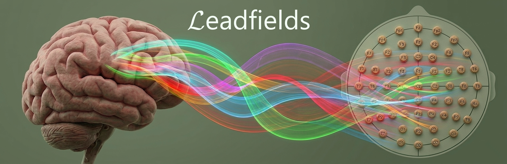

---

> [!TIP] 
> 🦅
> This package is part of the [Eegle.jl](https://github.com/Marco-Congedo/Eegle.jl) ecosystem for EEG data analysis and classification.

---

# Leadfields

This packege allow access to a leadfield computed by the [OpenMEEG](https://openmeeg.github.io/) software in [julia](https://julialang.org/) for
**1210 voxels** and up to **343 electrodes**.

The leadfield can be used for computing vector-type EEG inverse solutions using [Xloreta](https://github.com/Marco-Congedo/Xloreta.jl) and for advanced use of the [Gedai](https://github.com/Marco-Congedo/Gedai) denoising algorithm.

The specifications of the leadfield can be found in the "fsavLEADFIELD_4_GEDAI.pdf" file in the "leadfields" directory of this repository.


## 🧭 Index

- 📦 [Installation](#-installation)
- 🔣 [Problem Statement, Notation and Nomenclature](#-problem-statement-notation-and-nomenclature)
- 🔌 [API](#-api)
- 💡 [Examples](#-examples)
- ✍️ [About the Author](#️-about-the-author)
- 🌱 [Contribute](#-contribute)


## 📦 Installation

*julia* version 1.10+ is required.

Execute the following command in julia's REPL:

```julia
using Pkg
Pkg.add("https://github.com/Marco-Congedo/Leadfields.jl")
```

To test the package:
```julia
Pkg.test("Leadfields")
```

[▲ index](#-index)


## 🔣 Problem Statement, Notation and Nomenclature

See [Xloreta](https://github.com/Marco-Congedo/Xloreta.jl) first.

Using the problem statement, notation and nomenclature defined there, this package allows to access:
- The leadfield matrix 𝐊 ∈ ℝⁿ׳ᵖ, where n is the number of electrodes and p is the number of voxels.
- The electrode labels
- the electrode locations in 3D cartesian coordinates
- the voxel locations in 3D cartesian coordinates.

The voxel locations is always fixed. The leadfield can be computed for any collection of electrodes and with any electrical reference.

> [!WARNING] 
> Each label in the sought collection of electrodes must match one of the strings listed in the [sensors343.txt](https://github.com/Marco-Congedo/Gedai/tree/master/Documents/sensors343.txt) file (in a case-insensitive fashion).


[▲ index](#-index)


## 🔌 API

The package exports only one function, but a very general one:

```julia
function leadfield(labels=nothing; reference=0.0)
```

**Argument**

- `labels`: a vector of strings holding the electrode labels.

**Keyword Argument**
- `reference`: a reference electrode label as a string or a correction factor as a real number for computing the common average reference (CAR).

Both arguments are optional.

**Return** 

the 4-tuple comprising:
- a) the leadfield matrix: n(electrodes) x [1210(voxels) x 3(orientations)] 
- b) electrode labels: a n-vector of strings
- c) electrode locations: a n-vector of 3-vectors holding each the location in 3D cartesian coordinates
- d) voxel locations: a 1210-vector of 3-vectors holding each the location in 3D cartesian coordinates.

In the output tuple, d) (the voxel locations) is always the same.

By default `labels=nothing` and `reference=0.0`, thus n = 343, i.e., the function computes the leadfield matrix in the common average reference (rank-deficient, with rank n-1) for all available electrodes and returns the associated electrode labels and locations.

If `labels` is a vector of strings, n = length(labels) and (a, b, c) contain only the elements corresponding to the provided labels.

Furthermore,

1) If `reference` is equal to an electrode label (a string), the leadfield matrix is re-referenced to that electrode.
- case 1.1: `labels` is not provided:
    n = 343-1, since the elements of (a, b, c) corresponding to that electrode are removed.
- case 1.2: `labels` is provided:
    - 1.2.a: `reference` is in labels:
        n = length(labels)-1, since the elements of (a, b, c) corresponding to that electrode are removed.
    - 1.2.b: `reference` is not in labels:
        n = length(labels)

2) If `reference` is a real value the leadfield matrix is re-referenced to the (common average reference + `reference`), thus if `reference` = 0.0 (default), it is referenced to the (rank-deficient) common average reference, and if `reference` = 1.0, it referenced to the full-rank pseudo common average reference used by default in the [Gedai](https://github.com/Marco-Congedo/Gedai) denoising algorithm.
See the [Eegle.car!](https://marco-congedo.github.io/Eegle.jl/stable/Processing/#Eegle.Processing.car!) function for explanations
on the common average reference.

[▲ index](#-index)


## 💡 Examples

> [!WARNING] 
> If the leadfield is needed to compute an inverse solution by package [Xloreta](https://github.com/Marco-Congedo/Xloreta.jl), `labels` will hold the electrode labels for your data and `reference` must be 0.0 (default).


**Example for computing inverse solutions**

```julia
using Leadfields
labels = ["FP1", "FP2", "C3", "C4"]
K, ename, eloc, gridloc = leadfield(labels)
```

- `K` is a 4×3630 leadfield matrix referenced to the (rank-deficient) CAR, i.e., the usual CAR.
- `ename` is equal to `labels`
- `eloc` is a vector holding 4 vectors with the 3D electrode cartesian coordinates
- `gridloc` is a vector holding 1210 vectors with the 3D voxels cartesian coordinates

**Example for use with GEDAI denoising**

We will compute the leadfield matrix for the left Mastoid
file = selectDB(:MI)[16].files[1]
o = readNY(file)
K, ename, eloc, gridloc = leadfield(o.sensors; reference = "M1")
K, ename, eloc, gridloc = leadfield(reference = "M1")


[▲ index](#-index)


## ✍️ About the Author

[Marco Congedo](https://github.com/Marco-Congedo) and [Tomas Ros](https://github.com/neurotuning-personal)

[▲ index](#-index)


## 🌱 Contribute

Please contact the author if you are interested in contributing.

[▲ index](#-index)


