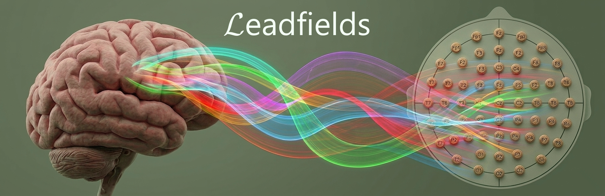

---

> [!TIP] 
> 🦅
> This package is part of the [Eegle.jl](https://github.com/Marco-Congedo/Eegle.jl) ecosystem for EEG data analysis and classification.

---

# Leadfields

This package allows to load and manipulate EEG **leadfield matrices** in [julia](https://julialang.org/)
and to generate the corresponding *.stl* files for plotting the cortex using Makie.jl.

This package works under the hook as a preparatory step for other packages: 
- [Xloreta.jl](https://github.com/Marco-Congedo/Xloreta.jl): computes inverse solution tranformation matrices using the leadfields matrices generated here
- CortexPlot.jl: Visualize inverse solution functional data on top of structural (cortex) data. Both depends on the leadfield generated here.
- [Gedai.jl](https://github.com/Marco-Congedo/Gedai): EEG artifact rejection using a leadfield matrix generated here.

The **leadfield matrices** provided by this package have been pre-computed via the [BrainStorm](https://neuroimage.usc.edu/brainstorm/Introduction) software by [OpenMEEG](https://openmeeg.github.io/) using the ‘fsaverage’ adult head model (FreeSurfer’s default template based on 40 normative brains). The computation of the leadfields is based on the Boundary Element Method (BEM).

> [!TIP] All supported leadfields are accessible for any subset of the **343 standard EEG electrode leads** listed 
> [here](https://github.com/Marco-Congedo/Leadfields.jl/blob/master/Documents/sensors343.txt).

The available leadfields correspond to  
 1) 3630 unconstrained brain dipolar sources (**1210 voxels** × 3 cartesian orientations): voxel size: 10mm
 2) 7509 unconstrained brain dipolar sources (**2503 voxels** × 3 cartesian orientations); voxel size: 4.3mm
 2) 15006 unconstrained brain dipolar sources (**5002 voxels** × 3 cartesian orientations); voxel size: 3mm

> [!WARNING] For the first model, no corresponding .stl file can be computed. This model is reserved for advanced use of the 
> [Gedai](https://github.com/Marco-Congedo/Gedai) denoising algorithm. The specifications of this model can be found 
> [here](https://github.com/Marco-Congedo/Leadfields.jl/blob/master/HeadModels/headmodel_1210.pdf).

> [!TIP] 
> FOR DEVELOPERS: The directions for generating other head models are [here](https://github.com/Marco-Congedo/Leadfields.jl/tree/master/Documents/BrainStorm_Directions.pdf).


## 🧭 Index

- 📦 [Installation](#-installation)
- 🔣 [Problem Statement, Notation and Nomenclature](#-problem-statement-notation-and-nomenclature)
- 🔌 [API](#-api)
- 💡 [Examples](#-examples)
- ✍️ [About the Author](#️-about-the-author)
- 🌱 [Contribute](#-contribute)


## 📦 Installation

*julia* version 1.10+ is required.

Execute the following command in julia's REPL:

```julia
using Pkg
Pkg.add(Leadfields)
```

To test the package:
```julia
Pkg.test("Leadfields")
```

[▲ index](#-index)


## 🔣 Problem Statement, Notation and Nomenclature

See the documentation of [Xloreta](https://github.com/Marco-Congedo/Xloreta.jl) and CortexPlot.jl first.

Referring to the problem statement, notation and nomenclature defined in the documentation of *Xloreta.jl* , this package allows to access:
- The leadfield matrix 𝐊 ∈ ℝⁿ׳ᵖ, where n is the number of electrodes and p is the number of voxels.
- The electrode labels
- the electrode locations in 3D cartesian coordinates
- the voxel locations in 3D cartesian coordinates.

The vector of voxel locations depends on the chosen leadfield, which can be computed for any collection of electrodes and with any electrical reference.

> [!WARNING] 
> Each label in the sought collection of electrodes must match one of the strings in this [list](https://github.com/Marco-Congedo/Leadfields.jl/blob/master/Documents/sensors343.txt) (in a case-insensitive fashion).

Referring the documentation of *CortexPlot.jl*, this package allows to generate and save .stl file for plotting
the inverse solution functional data on top of structural (cortex) images.

[▲ index](#-index)


## 🔌 API

The package exports only two functions:

```julia
function leadfield(labels=nothing; reference=0.0; voxels=2503)
```

**Argument**

- `labels`: a vector of strings holding the electrode labels.

**Optional Keyword Argument**
- `reference`: a reference electrode label as a string, or a correction factor as a real number for computing the common average reference (CAR).
- `voxels`: the number of voxels p in the head model. It can be `2503` or `5002`. 

**Return** 

the 4-tuple comprising:
- a) the leadfield matrix: n(electrodes) x [p(voxels) x 3(orientations)] 
- b) electrode labels: a n-vector of strings
- c) electrode locations: a n-vector of 3-vectors holding each the location in 3D cartesian coordinates
- d) voxel locations: a p-vector of 3-vectors holding each the location in 3D cartesian coordinates.

By default `labels=nothing` and `reference=0.0`, thus n = 343, i.e., the function computes the leadfield matrix in the common average reference (rank-deficient, with rank n-1) for all available electrodes and returns the associated electrode labels and locations.

If `labels` is a vector of strings, n = length(labels) and (a, b, c) contain only the elements corresponding to the provided labels.

> [!TIP] 
> If the leadfield is needed to compute an inverse solution by package [Xloreta](https://github.com/Marco-Congedo/Xloreta.jl), `labels` must hold the electrode labels for your data, in the same order used there, and `reference` must be 0.0 (default).

The following options are for advanced use of the Gedai.jl artifact rejection algorithm only (or if you know what you are doing):

1) If `reference` is equal to an electrode label (a string), the leadfield matrix is re-referenced to that electrode.
- case 1.1: `labels` is not provided:
    n = 343-1, since the elements of (a, b, c) corresponding to that electrode are removed.
- case 1.2: `labels` is provided:
    - 1.2.a: `reference` is in labels:
        n = length(labels)-1, since the elements of (a, b, c) corresponding to that electrode are removed.
    - 1.2.b: `reference` is not in labels:
        n = length(labels)

2) If `reference` is a real value, the leadfield matrix is re-referenced to the (common average reference + `reference`), thus if `reference` = 0.0 (default), it is referenced to the (rank-deficient) common average reference, and if `reference` = 1.0, it referenced to the full-rank pseudo common average reference used by default in the [Gedai](https://github.com/Marco-Congedo/Gedai) denoising algorithm.
See the [Eegle.car!](https://marco-congedo.github.io/Eegle.jl/stable/Processing/#Eegle.Processing.car!) function for explanations
on the common average reference.

[▲ index](#-index)

```julia
function gen_cortex_stl(savepath::String; voxels::Int = 2503)
```

Generate and save a .stl file for plotting the cortex in 2D or 3D using *Makie.jl* given the default brainstorm surface .mat file
generated for the given number of `voxels`. `voxels` can be 2503 (default) or 5002, which will create the .stl file
for the leadfield with 2503 or 5002 voxels, respectively. No .stl can be generated for the model with 1203 voxels.

`savepath` is the full path of the file where the .stl file will be saved.

[▲ index](#-index)


## 💡 Examples

**Example for computing inverse solutions**

```julia
using Leadfields
labels = ["FP1", "FP2", "F3", "F4", "C3", "C4", "P3", "P4", "O1", "O2"]
K, ename, eloc, gridloc = leadfield(labels) # default 2503-vector head model
```

- `K` is a 10×7509(2503x3) leadfield matrix referenced to the (rank-deficient) CAR, i.e., the usual CAR.
- `ename` is equal to `labels`
- `eloc` is a vector holding 10 vectors, each one with the 3D electrode cartesian coordinates
- `gridloc` is a vector holding 1210 vectors with the 3D voxels cartesian coordinates

For using the 5002-voxel model, use instead:
```julia
using Leadfields
labels = ["FP1", "FP2", "F3", "F4", "C3", "C4", "P3", "P4", "O1", "O2"]
K, ename, eloc, gridloc = leadfield(labels; voxels=5002) 
```

**Example for use with GEDAI denoising**

See the last example [here](https://github.com/Marco-Congedo/Gedai/tree/master?tab=readme-ov-file#-examples).


**Example for generating and saving .stl files**

```julia
using Leadfields
gen_cortex_stl(joinpath(homedir(), "cortex_2503.stl"))
```
This will generate the .stl file for the leadfield with 2503 voxels (default) and store it in the home directory.

To generate the .stl file for the leadfield with 5002 voxels, use instead:

```julia
using Leadfields
gen_cortex_stl(joinpath(homedir(), "cortex_5002.stl"); voxels = 5002)
```
[▲ index](#-index)


## ✍️ About the Author

[Marco Congedo](https://github.com/Marco-Congedo), Arthur Tatlian, Esteban Padilla and [Tomas Ros](https://github.com/neurotuning-personal).

[▲ index](#-index)


## 🌱 Contribute

Please contact the first author if you are interested in contributing.

[▲ index](#-index)


